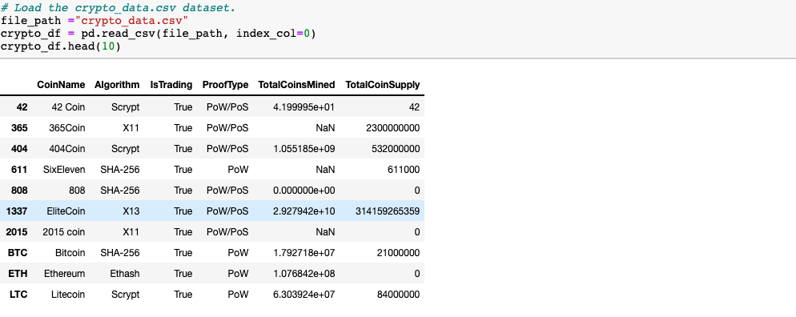
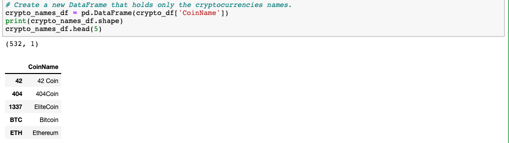
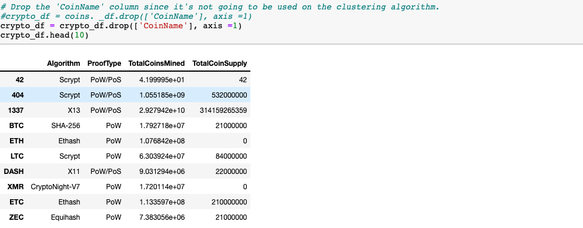
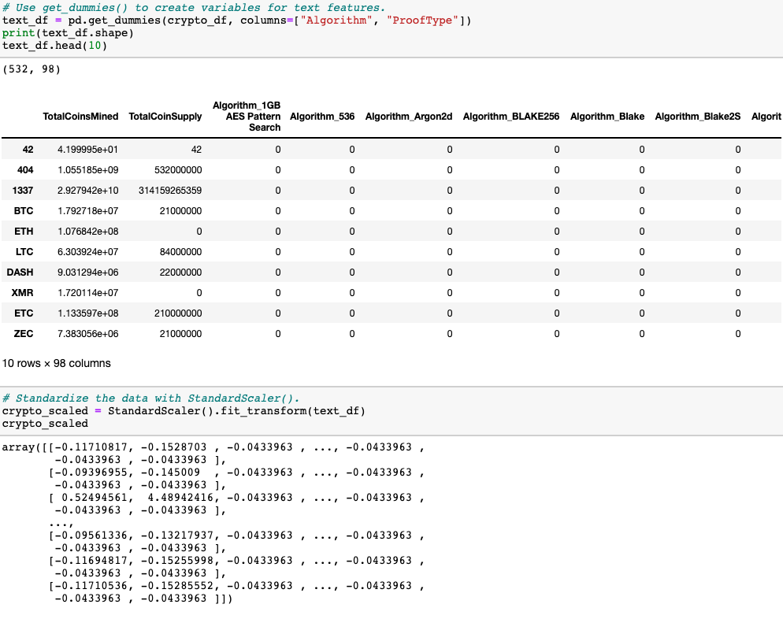
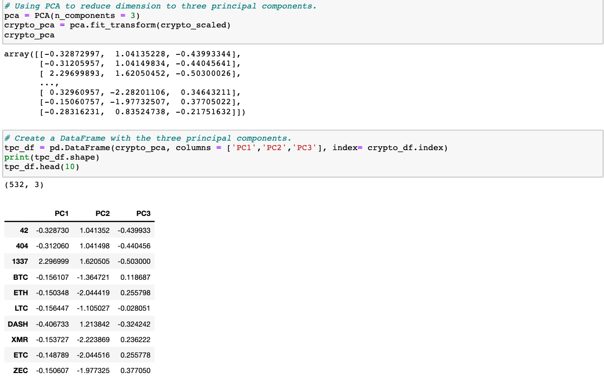
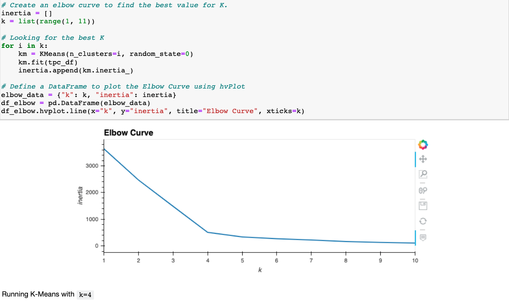
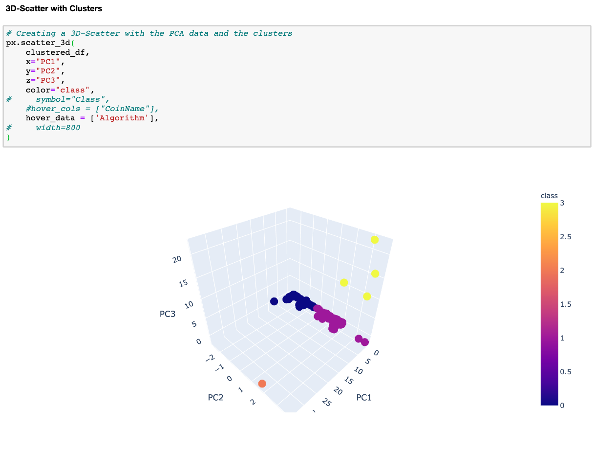
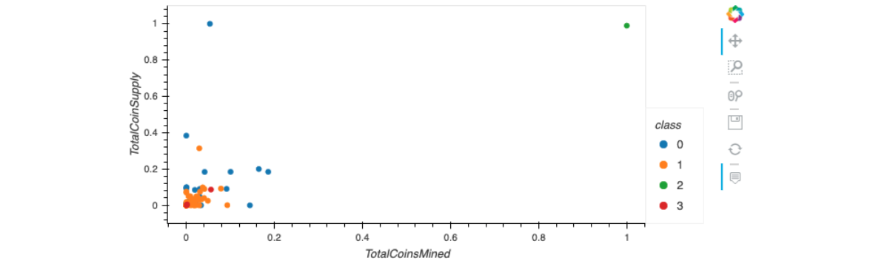

# Cryptocurrencies

## Overview of the analysis

The purpose of this analysis is to use unsupervised learning to  process data, cluster, reduce your dimensions, and  reduce the principal components using PCA. Create aa report that includes what cryptocurrencies are on the trading market and group cryptocurrencies to create a classification system for this new investment.

The four technical methods for the analysis:
- Deliverable 1: Preprocessing the Data for PCA
- Deliverable 2: Reducing Data Dimensions Using PCA
- Deliverable 3: Clustering Cryptocurrencies Using K-means
- Deliverable 4: Visualizing Cryptocurrencies Results

## Resources:

- Data Source: crypto_data.csv
- Software: Python 3.9, Visual Studio Code 1.50.0, Anaconda 4.8.5, Jupyter Notebook 6.1.4, Pandas

## Results:
### Deliverable 1: Preprocessing the Data for PCA

Chose the currencies that are trading

Dropped rows of data where Algorithm is N

Removed the "IsTrading" column

Removed all rows with NA values in any column

Kept the rows that have TotalCoinsMined value more than zero 

Created a new DataFrame that holds only the cryptocurrencies names:

Dropped the 'CoinName' column

Created variables for text features and Standardize the data with StandardScaler():

### Deliverable 2: Reducing Data Dimensions Using PCA

### Deliverable 3: Clustering Cryptocurrencies Using K-means

### Deliverable 4: Visualizing Cryptocurrencies Results

Hvplot Scatter Plot

## Summary: 

There are 532 tradable cryptocurrencies and they were grouped into 4 classes: class 0, class 1, class 2, and class 3.